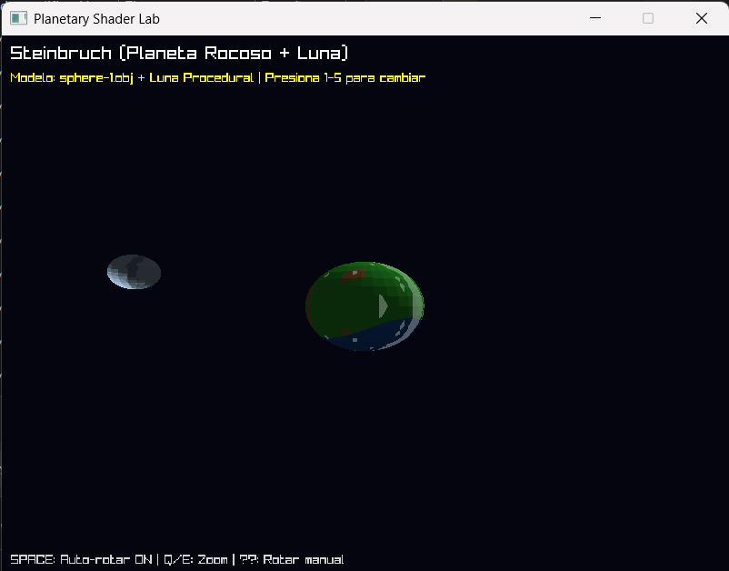
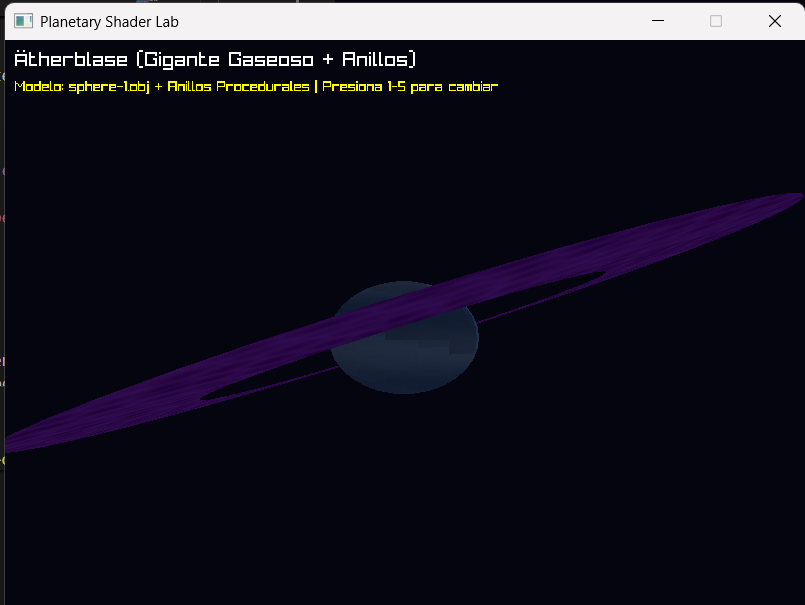
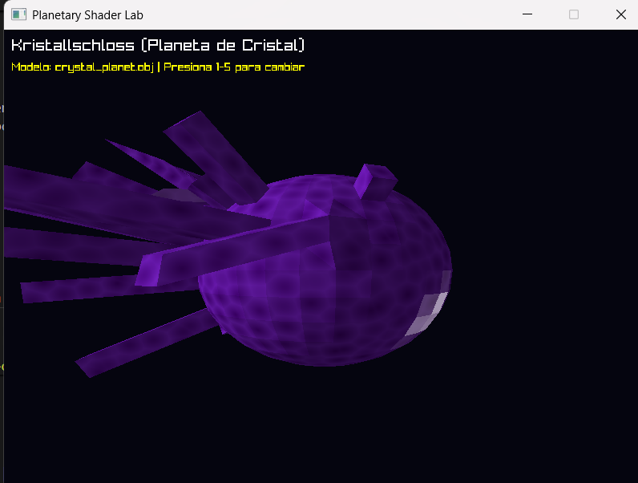
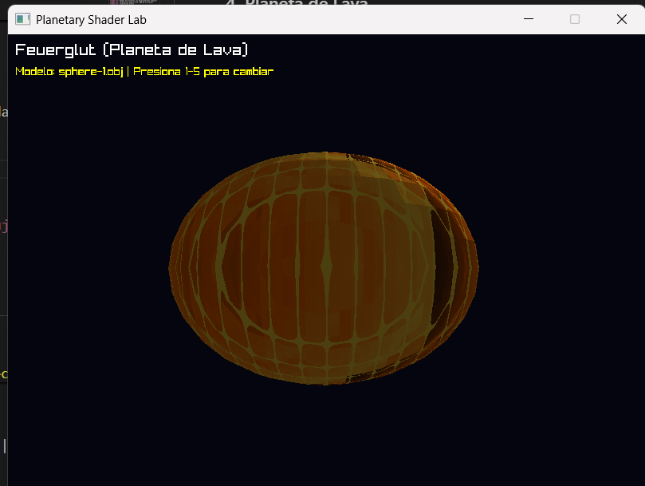
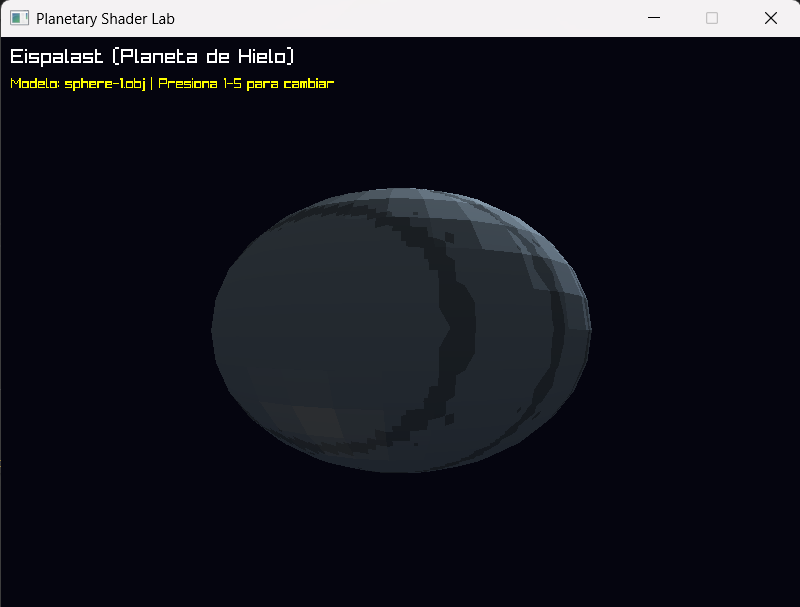

# Lab 4: Static Shaders

Sistema de renderizado 3D por software con shaders procedurales para planetas.

## 🌍 Características

- **5 Planetas Únicos**: Planeta, Júpiter, Cristal, Lava, Hielo
- **Geometría Procedural**: Luna orbital y anillos planetarios
- **Shaders de 4 Capas**: Cada planeta usa 4 capas de procesamiento de color
- **Vertex Shaders en CPU**: Transformaciones de vértices sin GPU
- **Rotación y Traslación**: Movimiento orbital realista

## 🎮 Controles

| Tecla | Acción |
|-------|--------|
| 1-5 | Cambiar entre planetas |
| SPACE | Toggle rotación automática |
| ← → | Rotación manual |
| Q / E | Zoom in / out |
| ESC | Salir |

## 🎨 Planetas y Shaders

### 1. Planeta Rocoso (Tierra)
**Shader**: `rocky_planet_shader`
- **Capa 1**: Gradiente vertical océano/tierra
- **Capa 2**: Ruido FBM para continentes
- **Capa 3**: Iluminación direccional
- **Capa 4**: Nubes procedurales animadas
- **Extra**: Luna orbital generada proceduralmente

**Uniforms**:
```rust
pos: &Vector3       // Posición del fragmento en espacio 3D
normal: &Vector3    // Normal del triángulo
time: f32           // Tiempo para animación (nubes)
```

### 2. Gigante Gaseoso (Júpiter)
**Shader**: `gas_giant_shader`
- **Capa 1**: Gradiente radial del centro
- **Capa 2**: Bandas horizontales con desplazamiento temporal
- **Capa 3**: Turbulencia atmosférica (FBM de 5 octavas)
- **Capa 4**: Iluminación difusa
- **Extra**: Anillos procedurales inclinados 23°


**Uniforms**:
```rust
pos: &Vector3       // Posición del fragmento
normal: &Vector3    // Normal para iluminación
time: f32           // Anima bandas y turbulencia
```

**Parámetros de Bandas**:
- `band_freq`: 10.0 (frecuencia de bandas)
- `band_offset`: time * 0.05 (velocidad de movimiento)

### 3. Planeta de Cristal
**Shader**: `crystal_planet_shader`
- **Capa 1**: Base púrpura con gradiente
- **Capa 2**: Patrón Voronoi para cristales
- **Capa 3**: Reflejos especulares (exp=32)
- **Capa 4**: Iluminación difusa


**Uniforms**:
```rust
pos: &Vector3       // Posición para patrón Voronoi
normal: &Vector3    // Normal para reflexión
time: f32           // Anima dirección de luz
```

### 4. Planeta de Lava
**Shader**: `lava_planet_shader`
- **Capa 1**: Flujo de lava animado (FBM)
- **Capa 2**: Grietas brillantes (patrón sinusoidal)
- **Capa 3**: Pulsación de calor
- **Capa 4**: Iluminación suave


**Uniforms**:
```rust
pos: &Vector3       // Posición para ruido de flujo
normal: &Vector3    // Normal para iluminación
time: f32           // Anima flujo y pulsación
```

**Parámetros de Flujo**:
- Velocidad X: `time * 0.2`
- Velocidad Z: `time * 0.15`
- Frecuencia grietas: 20.0

### 5. Planeta de Hielo
**Shader**: `ice_planet_shader`
- **Capa 1**: Base helada azul-blanca
- **Capa 2**: Grietas de hielo (FBM)
- **Capa 3**: Reflejos especulares suaves (exp=16)
- **Capa 4**: Variación por profundidad


**Uniforms**:
```rust
pos: &Vector3       // Posición para grietas
normal: &Vector3    // Normal para reflexión
time: f32           // (No usado actualmente)
```

## 🔧 Arquitectura de Shaders

### Fragment Shader (shader.rs)
Procesa cada píxel del triángulo rasterizado:

```rust
pub fn rocky_planet_shader(
    pos: &Vector3,      // Posición interpolada en espacio objeto
    normal: &Vector3,   // Normal del triángulo
    time: f32           // Tiempo global
) -> Color
```

### Vertex Shader (procedural_geometry.rs)
Genera y transforma vértices en CPU:

```rust
pub fn transform_model(
    model: &ObjModel,
    translation: Vector3,  // Posición en espacio mundo
    rotation_y: f32,       // Rotación en eje Y (radianes)
    rotation_x: f32,       // Rotación en eje X (radianes)
    scale: f32             // Factor de escala uniforme
) -> Vec<Vector3>
```

## 📐 Geometría Procedural

### Luna (generate_moon)
Genera esfera por coordenadas esféricas:
- **Radio**: 0.3 unidades
- **Segmentos**: 16x16
- **Órbita**: Radio 2.5, velocidad 0.02 rad/frame

```rust
// Coordenadas esféricas → Cartesianas
x = radius * sin(theta) * cos(phi)
y = radius * cos(theta)
z = radius * sin(theta) * sin(phi)
```

### Anillos (generate_rings)
Genera disco anular plano:
- **Radio Interno**: 1.3 unidades
- **Radio Externo**: 2.0 unidades
- **Segmentos**: 64 (resolución angular)
- **Inclinación**: 0.4 radianes (~23°)

```rust
// Círculo en plano XZ
x = radius * cos(angle)
z = radius * sin(angle)
y = 0.0
```

## 🛠️ Funciones Auxiliares

### Ruido Procedural

**FBM (Fractional Brownian Motion)**
```rust
fn fbm_noise(x: f32, y: f32, octaves: u32) -> f32
```
- Suma múltiples octavas de ruido
- Cada octava: frecuencia ×2, amplitud ×0.5
- Normalizado a rango [0, 1]

**Voronoi Pattern**
```rust
fn voronoi_pattern(x: f32, y: f32, z: f32) -> f32
```
- Busca celda más cercana en rejilla 3D
- Retorna distancia normalizada

### Interpolación de Color

**Lerp Color**
```rust
fn lerp_color(a: Color, b: Color, t: f32) -> Color
```
- Interpolación lineal por canal RGB
- `t` clampeado a [0, 1]

**Apply Brightness**
```rust
fn apply_brightness(color: Color, brightness: f32) -> Color
```
- Multiplica cada canal por factor
- Clamp a 255

**Blend Colors**
```rust
fn blend_colors(base: Color, top: Color, alpha: f32) -> Color
```
- Mezcla alpha estándar
- `result = base * (1-α) + top * α`

### Iluminación

**Reflexión Especular**
```rust
fn reflect(incident: &Vector3, normal: &Vector3) -> Vector3
```
- Formula: `R = I - 2(I·N)N`
- Usado para reflejos tipo espejo

## 📊 Pipeline de Renderizado

```
1. Cargar modelo OBJ → vértices + caras
2. Por cada frame:
   a. Vertex Shader: Transformar vértices (rotación, traslación, escala)
   b. Rasterización: Por cada triángulo:
      - Backface culling
      - Calcular bounding box
      - Coordenadas baricéntricas
      - Z-buffer test
   c. Fragment Shader: Por cada píxel visible:
      - Interpolar posición 3D
      - Aplicar shader (4 capas)
      - Escribir color a framebuffer
3. Presentar framebuffer como textura
```

## 📦 Estructura de Archivos

```
src/
├── main.rs                    # Loop principal y coordinación
├── framebuffer.rs             # Buffer de color y profundidad
├── triangle.rs                # Rasterizador de triángulos
├── shader.rs                  # 5 shaders planetarios
├── procedural_geometry.rs     # Generación de luna y anillos
├── obj_loader.rs              # Carga de modelos .obj
└── line.rs                    # Primitivas de línea (sin uso actual)
```

## 🚀 Compilación

```bash
cargo build --release
cargo run --release
```

**Requisitos**:
- Rust 1.70+
- raylib-rs
- Archivos: `sphere-1.obj`, `crystal_planet.obj` (opcional)

## 🎓 Conceptos Técnicos

### ¿Qué son Vertex Shaders en CPU?
A diferencia de GPU shaders (GLSL/HLSL), estos procesan vértices en software:
- **Input**: Vértices del modelo, matrices de transformación
- **Output**: Vértices transformados en espacio clip
- **Operaciones**: Rotación, traslación, escala, proyección

### ¿Por qué 4 Capas?
Cada capa agrega complejidad visual:
1. **Base**: Color/textura fundamental
2. **Detalle**: Ruido, patrones, variación
3. **Iluminación**: Difusa, especular, sombras
4. **Efectos**: Animación, atmósfera, glows

### Z-Buffer
Resuelve visibilidad sin ordenar triángulos:
```rust
if depth < z_buffer[pixel] {
    z_buffer[pixel] = depth;
    color_buffer[pixel] = shader_color;
}
```

## 📝 Notas de Implementación

- **Sin GPU**: Todo el rendering es por software (CPU)
- **Backface Culling**: Descarta triángulos hacia atrás
- **Coordenadas Baricéntricas**: Interpolación dentro del triángulo
- **Proyección Perspectiva**: FOV adaptativo por profundidad
- **60 FPS Target**: Optimizado para tiempo real

## 🐛 Solución de Problemas

- **Modelo no carga**: Verifica que `sphere-1.obj` existe en directorio raíz
- **Luna no se ve**: Presiona `1` para planeta rocoso
- **Anillos no aparecen**: Presiona `2` para gigante gaseoso
- **Rendimiento bajo**: Reduce resolución o número de segmentos en geometría procedural
